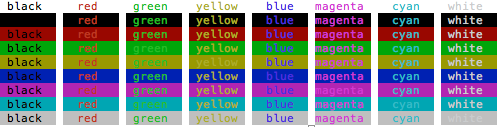

# prang

Version 1.0

Terminal used to output color tools for Python

**Install**

	sudo python setup.py install
	
**Usage**

```python
p = paint(foreground, background=None, attribute=None)
p(string)
```

**Examples**

```python
from prang import paint

green = paint('green')
print(green('Hello World'))
```


**Available foreground/background colors**
	
- black
- red
- green
- yellow
- blue
- magenta
- cyan
- white

**Available attributes**

- blod
- underscore
- blink
- reverse
- concealed


